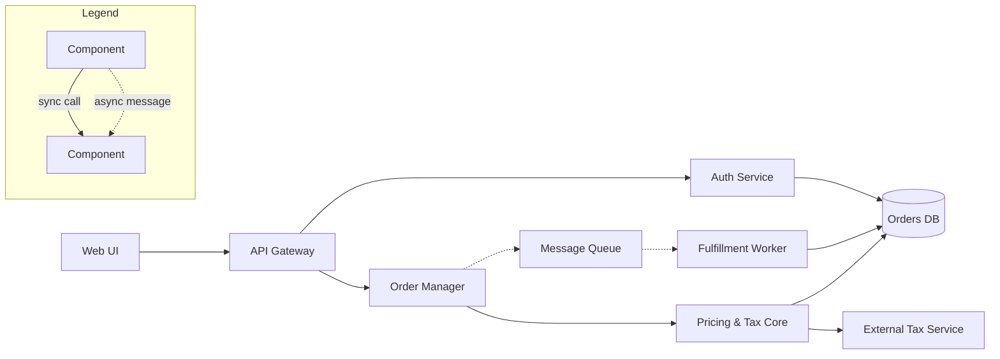

# Completed review for order-flow.mmd (input fixture for diagram-report evals)

## Diagram review: evals/fixtures/diagrams/order-flow.mmd

**Reviewed:** 2026-07-20

**Purpose (rule 1):** Unclear — no title or caption; appears to show order processing flow, but static structure and message flow are mixed.

| # | Rule | Verdict | Finding |
|---|------|---------|---------|
| 1 | One purpose | ⚠️ | No stated purpose; mixes structure with data flow |
| 2 | Legend | ❌ | Solid vs. dashed arrows and cylinder shape unexplained |
| 3 | Established notation | ⚠️ | Freehand boxes-and-arrows without legend backing |
| 4 | Names defined | ❌ | "Mgr", "Core", "GW", "Q", "Wrk" — cryptic, no element table |
| 5 | Consistent naming | ➖ | Single diagram, nothing to compare against |
| 6 | Spare with details | ✅ | No excess detail |
| 7 | ~12 elements | ✅ | 9 elements |
| 8 | Minimal styling | ✅ | No decoration |
| 9 | Key element central | ⚠️ | No visual emphasis on the core element |
| 10 | Readable | ✅ | Renders legibly |
| 11 | Layout discipline | ⚠️ | No grouping of related elements |
| 12 | Line crossings | ✅ | None |

**Top 3 fixes (highest impact first):**
1. Add a legend distinguishing solid (sync call) from dashed (async message) arrows and the database shape
2. Rename cryptic nodes to full names and add an element table (name → responsibility)
3. Add a one-sentence title stating the diagram's single purpose

## Redraw

**Legend:** solid arrow = synchronous call, dashed arrow = asynchronous message, cylinder = database.

**Element table:**

| Element | Responsibility |
|---|---|
| Web UI | Customer-facing storefront |
| API Gateway | Single entry point, routing and rate limiting |
| Auth Service | Authentication and session validation |
| Order Manager | Order lifecycle orchestration |
| Pricing & Tax Core | Price and tax calculation |
| Message Queue | Decouples order intake from fulfillment |
| Fulfillment Worker | Processes queued orders asynchronously |
| Orders DB | Persistent storage for orders and sessions |
| External Tax Service | Third-party tax-rate lookup |
